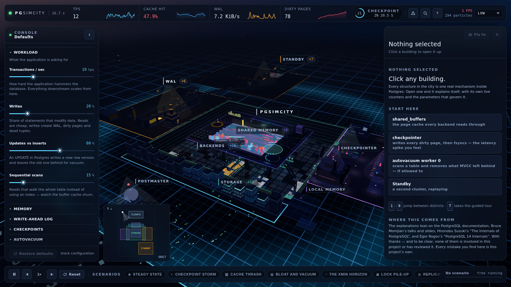

# PGSimCity

**An explorable 3D city that shows how PostgreSQL actually works.**

**Live: <https://nikolays.github.io/PGSimCity/>**

[](https://news.ycombinator.com/item?id=49063754)

> 🍊 **#1 on [Hacker News](https://news.ycombinator.com/item?id=49063754)** — thanks to everyone who
> visited, and especially to those who filed corrections. Bug reports about PostgreSQL behaviour are
> the most valuable thing this project can receive; see the prototype note below.



Every building is a real mechanism. The plaza in the centre is `shared_buffers` —
1024 page frames whose height is their clock-sweep usage count and whose colour is
their true state. The amber district to the east is the write-ahead log. The pit
under the plaza is the data directory, and the heap files down there grow when you bloat
them. To the south, a standby replays what the primary sends it, always a little
behind.

It is built for engineers who are good at their job and have never had to operate
a database — the people who need to understand why a checkpoint spikes latency,
why one forgotten transaction bloats a table forever, and what `synchronous_commit`
is really charging them.

---

> ### This is a prototype (v0.1)
>
> It was built quickly, and it **almost certainly contains inaccuracies and mistakes** — in the
> simulation as well as in the explanations. It is a *model* of PostgreSQL, not an emulator:
> no PostgreSQL source code runs here, and the numbers are scaled so a human can watch them.
>
> If you spot something wrong, especially a claim about how PostgreSQL actually behaves, please
> [open an issue](https://github.com/NikolayS/PGSimCity/issues/new) or send a
> [pull request](https://github.com/NikolayS/PGSimCity/pulls). Corrections from people who know
> the engine are exactly what this needs.

---

## A possible future

Today the city uses a hand-written simulation of PostgreSQL’s mechanisms, which is what makes internals such as the clock sweep’s frame-by-frame victim choice observable. A real PostgreSQL compiled to WebAssembly — PGlite and similar projects embed the actual engine — would make query results and plans authoritative, but could expose only what PostgreSQL exposes through catalogs, `pg_stat_*` views, and `EXPLAIN`, not those internal steps. They answer different questions; a future hybrid could let real execution and plans drive the modelled interior, but that is a direction rather than a promise.

---

## Run it

Node.js 20 or newer, and a browser with WebGL2.

```bash
npm install
npm run dev      # http://localhost:5173
```

```bash
npm run build    # static bundle in dist/
npm run preview
npm run typecheck
```

No server, no database, no network calls. It is a single static bundle.

---

## Controls

### Camera

| | |
|---|---|
| Left-drag | Pan — grab the ground and move it, the way a map does |
| Right-drag | Orbit around the city |
| Middle-drag / `Ctrl`-left-drag | Pan / orbit, if you have model-viewer habits |
| Wheel | Zoom — the dolly follows the cursor, not the pivot |
| Touch | 1 finger pans · 2 fingers pinch to zoom, twist to turn, drag up/down to tilt |
| Click | Select a building. In fly mode, capture the mouse |
| `W` `A` `S` `D` or the arrow keys | Move |
| `Space` or `E` · `C` or `Q` | Rise · descend (fly mode) |
| `PageUp` / `PageDown` | Change altitude (any mode) |
| `Shift` · `Alt` | Boost · precision |
| `Esc` | Leave pointer lock |

### Keys

| | |
|---|---|
| `F` | Toggle fly / orbit camera |
| `G` | Get down and walk the city on foot, 1.7 m tall |
| `H` | Back to the establishing shot |
| `T` | Guided tour — the whole city in 14 chapters |
| `/` or `Ctrl-K` | Command palette — search every component, setting and scenario |
| `?` | Keyboard map and colour legend |
| `L` | Toggle the floating labels |
| `K` or `P` | Pause / resume |
| `,` `.` | Slower / faster (0.1× – 5×) |
| `R` | Reset to the default settings |
| `Esc` | Close the topmost overlay |
| `1` – `8` | Jump to a district: clients, backends, shared buffers, WAL, storage, checkpointer, autovacuum, standby |

---

## What you are looking at

| District | What it is |
|---|---|
| **Client sky** (north, above) | Connections arriving from the application tier |
| **Postmaster** | The supervisor. Forks one backend per connection and never touches your data |
| **Backend row** | 16 backend processes. Their lighting *is* their state — including `idle in transaction` |
| **Shared memory plaza** | `shared_buffers`, `wal_buffers`, the ProcArray, the lock table, CLOG, the buffer mapping table |
| **The excavation** | Where memory ends and disk begins |
| **Storage** (below) | Heap files as fields of 8 KiB pages, B-trees as actual trees, TOAST, the FSM and visibility map, the OS page cache, the disks |
| **WAL district** (east) | walwriter → `pg_wal` segments → archiver → walsender |
| **Maintenance yard** (west) | checkpointer, background writer, autovacuum launcher and its workers |
| **Standby** (south) | walreceiver, the startup process replaying WAL, and the lag between them |
| **Query lab** (above the backends) | Select a backend and its statement unfolds: parse → rewrite → plan → execute |

Colour is semantic everywhere and never decorative: **WAL is amber**, **dirty pages
are red**, **clean pages are blue**, **vacuum is violet**, **checkpoints are pink**,
**the background writer is teal**, **replication is orange**, **storage is green**,
**indexes are aqua**, **locks are red**.

---

## Things worth trying

- Drag **`shared_buffers`** down to 64 pages and watch the plaza thrash: usage
  counts collapse, the clock hand races, and backends start writing out their own
  dirty pages because nothing clean is left to evict.
- Turn on **Long-running transaction**. The xmin horizon blade in the ProcArray
  sinks and goes red, the autovacuum trucks keep driving their whole route, and
  their scoops come up empty every single time. The `sessions` table bloats and
  never recovers. This is the most expensive lesson in the app.
- Run the **Checkpoint storm** scenario. Watch the checkpointer's flywheel spin
  up, the fsync phase shudder, and then a wall of full-page writes flood the WAL
  district immediately afterwards.
- Set **`synchronous_commit`** to `off` and watch every backend stop waiting in
  `commit_wait`. Then read what you just traded away.
- Turn on **Slow replay** and watch the four LSNs on the standby's ruler — sent,
  written, flushed, applied — pull apart. That gap is `pg_stat_replication`.
- Press **`G`** and walk in at eye level. A buffer you have been looking down on
  from 400 units up is a different object when it is three times your height.

---

## How it is built

```
src/
  core/      contracts — types, the event bus, the palette, the component registry
  engine/    renderer + post-processing, camera rig, particle flows, labels,
             picking, and the collision world the walk mode stands on
  sim/       the PostgreSQL model. No three.js in here, ever.
  world/     layout.ts is the city plan; one module per district
  ui/        HUD, control rail, inspector, guided tour, command palette, and the
             written explanations for every component
```

Three rules hold it together:

1. **`world/layout.ts` is the single source of truth for geography.** Anchors,
   table definitions and the route network live there. No district hard-codes a
   coordinate another district needs.
2. **The simulation never imports three.js, and the world never mutates the
   simulation.** They meet at `SimState`.
3. **Structure is matte, meaning is neon.** Only emissive materials cross the
   bloom threshold, so anything that glows is carrying information.

Stack: [three.js](https://threejs.org) r185, TypeScript, Vite. One runtime
dependency, no framework, no CDN, no telemetry.

`window.PGSIMCITY` in the browser console hands you
`{ sim, registry, bus, rig, gfx, flows }`, if you would rather drive the city
from the outside.

---

## Honesty

This is a *model*, not an emulator. The algorithms are real — clock-sweep
replacement, WAL insert/write/flush positions, checkpoint pacing against
`checkpoint_completion_target`, autovacuum thresholds, the xmin horizon blocking
cleanup, HOT updates skipping index maintenance — but the numbers are scaled so a
human can watch them. 1024 buffers stand in for a million; one particle stands in
for thousands of tuples. Nothing here parses SQL, and no byte of PostgreSQL source
code runs in your browser.

Where it simplifies, the inspector says so.

---

## Licence

[Apache-2.0](LICENSE). Copyright 2026 Nikolay Samokhvalov. See [NOTICE](NOTICE).

PostgreSQL is a trademark of the PostgreSQL Community Association of Canada.
PGSimCity is an independent educational project and is not affiliated with,
sponsored by, or endorsed by the PostgreSQL project.
