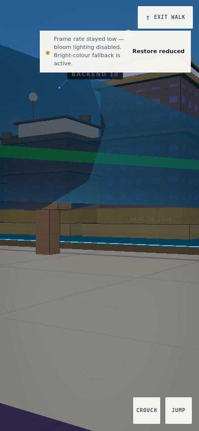
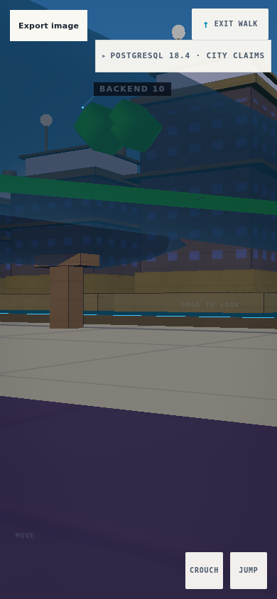
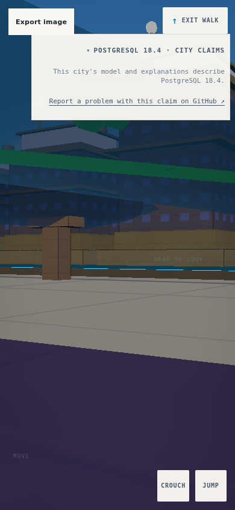
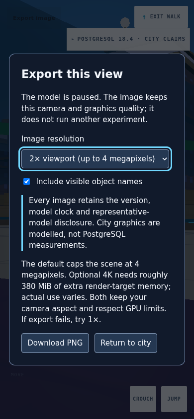
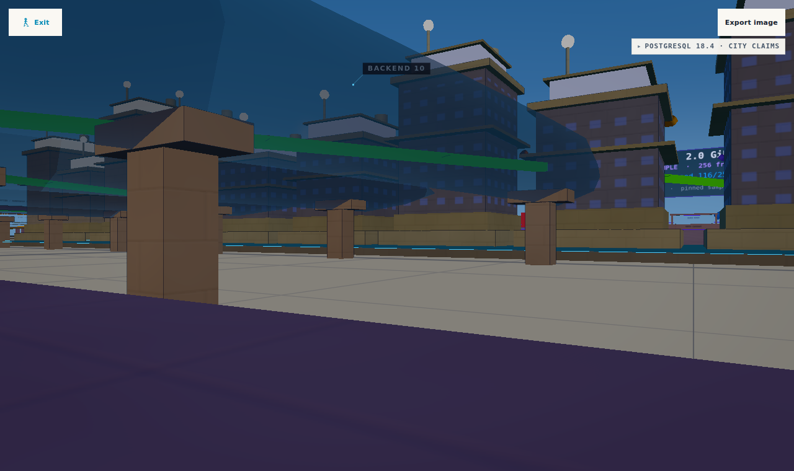
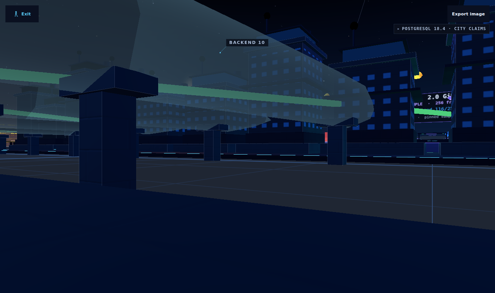

# Touch-walk export evidence

Reconstructed against published `ae37c97`; implementation commit `769f19e`.
The unavailable `1b632e4` / `e0bb43b` commits were not recovered or assumed identical.

- Before: export and model qualification inherit hidden HUD visibility.
- After: native touch opens/closes qualification and export dialog; export pauses
  the model and closing restores its prior running state. Move/look hit targets
  remain available. Export is 44px high and does not overlap the qualification.
- Day/night contrast: 15.14:1 and 16.66:1, measured after theme rendering settles.
- Typecheck/build passed. Full suite: 1,089 tests passed, one opt-in soak skipped.
- Repeatable driver: `tools/verify-presentation-touch.mjs`, invoked via the capped
  repository screenshot driver with mobile touch emulation.

These are inspected UI screenshots, **not downloaded PNG-export output** and not
physical-device or hardware-performance evidence. Low graphics quality and a held
model during disclosure checks avoid unrelated adaptive-quality and backup notices;
notification behavior is unchanged. Actual PNG export, materials integration, exact
published-head CI and independent REV remain separate acceptance gates.

